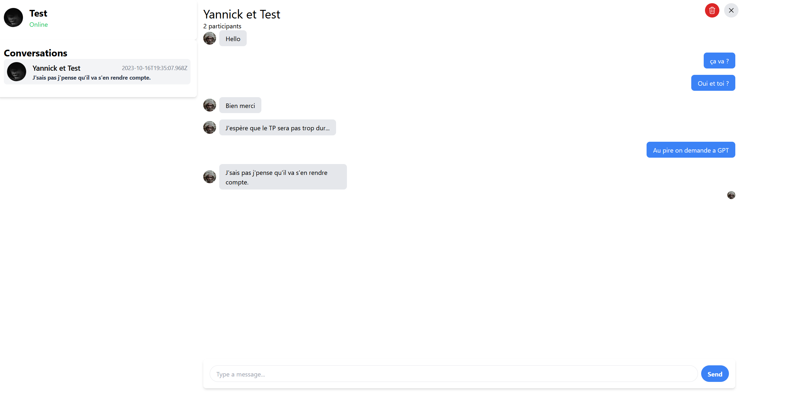

# Projet Messenger

Au cours de ce projet, nous allons créer un serveur capable de dialoguer avec un client, pour recréer l'application Messenger.
Ce projet utilisera **Node.js**, **express** pour gérer les routes HTTP, mais aussi **socket.io** pour le dialogue ininterrompu entre le serveur et les clients.
La base de données sera hébergée par **MongoDB**.

## Présentation

Nous allons utiliser le client situé dans le dossier client. 
Prenez le zip [MessengerClient](./MessengerClient.zip), et extrayez le à l'extérieur du dossier contenant le projet.

Vous allez devoir installer le package serve globalement à votre machine, pour pouvoir lancer le client.

```bash
npm install --global serve
```

Ensuite, pour lancer le client, vous devez exécuter la commande suivante, depuis le dossier contenant le zip que vous avez extrait.

```bash
serve ./MessengerClient
```

Vous devriez avoir ce résultat:


Vous pouvez désormais accéder au client via l'adresse notée.
Lorsque vous le lancez, vous arrivez sur la page de connexion. Si le nom d'utilisateur n'existe pas, le compte sera crée en conséquence, pour plus de simplicité. 
Le serveur n'aura donc qu'une seule route /login, qui sera responsable de la création & de la connexion d'un utilisateur.


Une fois arrivé sur la page principale, vous avez accès a toutes les personnes actuellement connectées.
Vous pouvez naviguer parmis vos conversations, en créer de nouvelle, et prendre part à chaque conversation, via envoi de message, éditions, ect...




## Notation

Vous serez évalué par groupe de **3** maximum. 
La notation du projet se fera sur **100**. 
**70** points seront répartis sur les features de l'application, et **30** points seront attribuées pour la qualité de votre code. Pensez à soigner votre code, pour qu'il soit lisible, réutilisable, et efficace. 

## 1. Les modèles de données *(10 pts)*

Avant toute chose, nous allons définir notre modèle de données pour le stockage dans la BDD.
Nous allons utiliser 3 collections: 
- **User**
- **Conversation**
- **Message**. 

### 1.1 Le modèle User *(2 pts)*

Un utilisateur sera représenté par plusieurs attributs. Pensez à bien respecter le nom de chaque attribut. 
- *username*, contenant le nom de l'utilisateur 
- *password*, contenant le mot de passe (bien entendu stocké crypté)
- *profilePicId*, contenant un ID de photo récupéré via le fichier pictures.ts

### 1.2 Le modèle Conversation *(5 pts)*

Une conversation sera représentée de la manière suivante :
- *participants*, devra être un tableau des différents participants de la conversation
- *messages*, devra être un tableau des différents messages de la conversation
- *title*, représentera le titre de la conversation. Par défaut, le titre sera nommé en fonction des participants.
Si Sophie, Marc et Alice sont dans une conversation, le titre de cette dernière sera "Sophie, Marc et Alice" (l'ordre n'importe que peu)
- *lastUpdate*, représentera la date a laquelle la conversation a pour la dernière fois été modifié.
Une conversation est considérée comme modifié lorsqu'un message est ajouté, modifié, supprimé. Les réactions ne modifie pas cette valeur. 
- *seen*, est un objet ayant une correspondance userId => messageId

### 1.3 Le modèle Message *(3 pts)*

Un message possèdera les attributs suivants: 
- *conversationId*, pour référencer la conversation dans laquelle se trouve le message
- *from*, sera une référence vers l'utilisateur qui a envoyé le message
- *content*, represéntera le contenu du message
- *postedAt*, sera la date a laquelle l'objet a été posté
- *replyTo*, contiendra le message auquel le message courrant est en train de répondre. Cette valeur peut être laissé a null.
- *edited*, un flag pour stipuler si le message a été modifié ou non
- *deleted*, un flag pour stipuler si le message a été supprimé ou non
- *reactions*, un objet contenant une correspondance userId => reaction. Les réactions seront choisies parmies les possibilités suivantes: **HAPPY**, **SAD**, **THUMBSUP**, **THUMBSDOWN**, **LOVE**

---
> **HINT**
>
> Avec mongoDB, il est possible de stocker l'identifiant d'une entrée d'une autre collection pour un objet.
>
> Lors de la délcaration du modèle, il faut utiliser le bloc de code suivant
>```javascript
>otherCollectionId: {
>	type: Schema.ObjectId, 
>	ref: "OtherCollectionName"
>}
>```
>
> Cela vous permet de stocker un id de mongoDB dans un élément. 
> Lorsque vous allez récupérer cet élément, vous aurez l'identifiant uniquement.
> Puisque faire une requête pour chaque identifiant de chaque élément que vous récupérez peut être long,
> Nous allons remplir directement ce champ au moment de la requête.
>```javascript
> let object = await Collection.findById(id);
> let objectPopulated = await object.populate("otherCollectionId");
>```
>
> Mongoose va automatiquement remplir, pour l'élément object que vous avez récupéré,
> le champ otherCollectionId avec le contenu de l'objet dans l'autre collection.

---

## 2. Les controlleurs de la base de données *(10 pts)*

Pour chaque collection, nous allons devoir créer un controlleur de données, qui va nous permettre d'exécuter toutes les actions de communication avec la base. 
Ce sont les *CRUD* opérations (et plus, si vous avez besoin de requêtes supplémentaires) pour chaque collection.
Ces controlleurs seront les éléments constituant de notre objet **Database** au sein du code. 

### 2.1 Le controlleur User *(2 pts)*

Ce controleur sera responsable de toutes les actions relatives à la collection **User**. 
Parmis ces fonctions, vous allez avoir besoin des suivantes: 
- *createUser*
- *getUserByName*
- *getUserById*
- *getUsersByIds*

Et toute autre fonction dont vous pouvez avoir besoin. 

### 2.2 Le controlleur Conversation *(4 pts)*

Ce controleur sera responsable de toutes les actions relatives à la collection **Conversation**. 
Parmis ces fonctions, vous allez avoir besoin des suivantes: 
- *getConversationWithParticipants*
- *getAllConversationsForUser*
- *getConversationById*
- createConversation
- *addMessageToConversation*
- *setConversationSeenForUserAndMessage*
- *deleteConversation*

Et toute autre fonction dont vous pouvez avoir besoin.

### 2.3 Le controlleur Message *(4 pts)*

Ce controleur sera responsable de toutes les actions relatives à la collection **Message**. 
Parmis ces fonctions, vous allez avoir besoin des suivantes: 
- *createMessage*
- *editMessage*
- *deleteMessage*
- *reactToMessage*
- *getMessageById*

Et toute autre fonction dont vous pouvez avoir besoin.

---

## 3. Les routes HTTP *(15 pts)*

Le serveur devra exposer un certain nombre de routes HTTP, afin que le client puisse communiquer avec nous pour agir sur la base de données, et récupérer les infos souhaitées.

Vous trouverez le détail de ce que doit renvoyer chaque route.
Pour chaque route, en cas d'erreur, la réponse du serveur devra ressembler à ceci:
```json
{
	"error": ""
}
```
L'erreur sous forme de string, ou d'objet. Dans l'idéal sous forme de string.

### 3.1 Les routes User *(3 pts)*

Nous allons avoir simplement 2 routes pour les utilisateurs.
Ces routes doivent avoir pour préfixe **"/users/"**. 

<details>
<summary>
	<b>3.1.1 La route login</b>
</summary>

</br>

Cette route permettra aux utilisateurs de se connecter à notre application. 

_PATH:_ /login
<br/>
_METHODE:_ POST
<br/>
_BODY:_
```json
{
	"username":"username",
	"password":"password"
}
```
_CODE DE RETOUR POSSIBLES:_ 200, 400, 500
<br/>
_REPONSE:_
```json
{
	"user":{
		"_id":"b48644bz6r15zr1561b65"
		//...
	},
	"token":"token d'authentification",
	"isNewUser":true// ou false
}
```
</details>

<details>
<summary>
	<b>3.1.2 La route online</b>
</summary>

</br>

Cette route permettra de récupérer tout les utilisateurs actuellement connectés à l'application.
On considèrera, par simplicité, qu'un client est connecté à l'application à partir du moment où son socket est ouvert avec le serveur.

_PATH:_ /online
<br/>
_METHODE:_ GET
<br/>
_BODY:_ Aucun
<br/>
_CODE DE RETOUR POSSIBLES:_ 200, 401, 500
<br/>
_REPONSE:_
```json
{
	"users": [
		{
			"_id":"b48644bz6r15zr1561b65"
			//...
		},
		{
			"_id":"grzghz15646zrz6g65156"
			//...
		},
	]
}
```
</details>

### 3.2 Les routes Conversations *(7 pts)*

Ces routes doivent avoir pour préfixe **"/conversations/"**.
Chaque route devra vérifier si l'utilisateur envoie bien un token d'authentification.
Ce token nous permettra de déduire l'identifiant de l'utilisateur.

<details>
<summary>
	<b>3.2.1 La route de création de conversation</b>
</summary>

</br>

_PATH:_ /
<br/>
_METHODE:_ POST
<br/>
_BODY:_
```json
{
	"concernedUsersIds":[
		"b48644bz6r15zr1561b65",
		"grzghz15646zrz6g65156",
		"..."
	]
}
```
_CODE DE RETOUR POSSIBLES:_ 200, 400, 401, 500
<br/>
_REPONSE:_
<br/>
```json
{
	"conversation":{
		"_id":"idconv",
		//....
	}
}
```
</details>

<details>
<summary>
	<b>3.2.2 La route de récupération des conversations</b>
</summary>

</br>

Cette route récupère toutes les conversations dans lesquelles prends part l'utilisateur à l'origine de la requête. 

_PATH:_ /
<br/>
_METHODE:_ GET
<br/>
_BODY:_ Aucun
<br/>
_CODE DE RETOUR POSSIBLES:_ 200, 400, 401, 500
<br/>
_REPONSE:_
```json
{
	"conversations":[
		{
			"_id":"idconv",
			//....
		},
		{
			"_id":"idconv2",
			//....
		},
		//...
	]
}
```
</details>

<details>
<summary>
	<b>3.2.3 La route de suppression de conversation</b>
</summary>

</br>

_PATH:_ /:id
<br/>
_METHODE:_ DELETE
<br/>
_BODY:_ Aucun
<br/>
_CODE DE RETOUR POSSIBLES:_ 200, 400, 401, 404, 500
<br/>
_REPONSE:_
```json
{
	"conversation":{
		"_id":"idconv",
		//....
	}
}
```
</details>

<details>
<summary>
	<b>3.2.4 La route de vue de conversation</b>
</summary>

</br>

_PATH:_ /see/:id
<br/>
_METHODE:_ POST
<br/>
_BODY:_ 
```json
{
	"messageId":"messageId"
}
```
_CODE DE RETOUR POSSIBLES:_ 200, 400, 401, 404, 500
<br/>
_REPONSE:_
```json
{
	"conversation":{
		"_id":"idconv",
		//....
	}
}
```
</details>

<details>
<summary>
	<b>3.2.4 La route de nouveau message</b>
</summary>

</br>

_PATH:_ /:id
<br/>
_METHODE:_ POST
<br/>
_BODY:_ 
```json
{
	"content":"contenu du message",
	"messageReplyId":"msgReplyId"// <= optionnel.
}
```
_CODE DE RETOUR POSSIBLES:_ 200, 400, 401, 500
<br/>
_REPONSE:_
```json
{
	"conversation":{
		"_id":"idconv",
		//....
	}
}
```
</details>

### 3.3 Les routes Messages *(5 pts)*

Ces routes doivent avoir pour préfixe **"/messages/"**.
Chaque route devra vérifier si l'utilisateur envoie bien un token d'authentification.
Ce token nous permettra de déduire l'identifiant de l'utilisateur.

<details>
<summary>
	<b>3.3.1 La route d'édition</b>
</summary>

</br>

_PATH:_ /:id
<br/>
_METHODE:_ PUT
<br/>
_BODY:_ 
```json
{
	"newMessageContent":"contenu du message"
}
```
_CODE DE RETOUR POSSIBLES:_ 200, 400, 401, 404, 500
<br/>
_REPONSE:_
```json
{
	"message":{
		"_id":"idmsg",
		//....
	}
}
```
</details>

<details>
<summary>
	<b>3.3.2 La route de réaction</b>
</summary>

</br>

_PATH:_ /:id
<br/>
_METHODE:_ POST
<br/>
_BODY:_ 
```json
{
	"reaction":"HAPPY"// "SAD", ...
}
```
_CODE DE RETOUR POSSIBLES:_ 200, 400, 401, 404, 500
<br/>
_REPONSE:_
```json
{
	"message":{
		"_id":"idmsg",
		//....
	}
}
```
</details>

<details>
<summary>
	<b>3.3.3 La route de suppression </b>
</summary>

</br>

_PATH:_ /:id
<br/>
_METHODE:_ DELETE
<br/>
_BODY:_ Aucun
<br/>
_CODE DE RETOUR POSSIBLES:_ 200, 400, 401, 404, 500
<br/>
_REPONSE:_
```json
{
	"message":{
		"_id":"idmsg",
		//....
	}
}
```
</details>

## 4. Les middlewares *(10 pts)*

Nous allons avoir au moins 2 middlewares pour ce projet.
Le premier sera le middleware d'authentification, responsable de la vérification du token présent dans les requêtes.
Le second sera un middleware de validation, propulsé par le package joi. Il permettra de valider le format du body de chaque requête.

### 4.1 Middleware d'authentification *(4 pts)*

Lors de la connexion d'un utilisateur, nous allons générer un nouveau token, grâce au package **jsonwebtoken** comme vu lors du TD.
Nous allons encoder un objet json contenant l'id de l'utilisateur dans ce token.

Pour chaque requête entrante, nous allons vérifier le header **authorization**.
Le contenu de ce paramètre sera le token, qui sera obligatoire pour toutes les requêtes pouvant retourner un code 401.
Dans le cas ou aucun token n'est fourni, nous voulons retourner une erreur stipulant qu'il nous faut un token.
Dans le cas ou le token est fourni, deux possibilités 
	=> Le token est valide, le middleware passe à la suite.
	=> Le token n'est pas valide, on retourne le code 401, en stipulant que le token n'est pas autorisé. 

### 4.2 Middleware de validation *(6 pts)*

Vous trouverez dans le fichier [JoiRequestValidator](./src/JoiRequestValidator.ts) le contenu de base de la classe qui permettra d'implémenter ce middleware. 

Cette classe contiendra un objet pour chaque route nécéssitant une validation. 
L'objectif, lors d'une requête, est de vérifier si la route est présente dans notre tableau, et si c'est le cas, valider le format de la requête via ce le validator présent dans l'objet du tableau. 

La fonction **validate(req)** devra retourner un objet vide dans le cas ou le body est valide, et un objet avec une clé error (ainsi que le détail) dans le cas inverse.

### 5. Les évènements de socket *(15 pts)*

Etant donné que nous sommes dans une application en temps réel, nous avons besoin de socket.io pour conserver un canal de communication bi-directionnel entre le serveur et chaque client. 

Tout le traitement lié au socket se situera dans le fichier [socketController](./src/socketController.ts).

Cette classe permettra d'écouter chaque évèment socket dès que la fonction **connect()** est appelée. 
Nous récupèrerons l'id de l'utilisateur connecté grâce aux extraHeaders, contenant la clé userid.

Nous allons utiliser quelque-chose d'un peu plus organisé lors du TP pour les conversations. 
Pour chaque conversation, nous allons créer une room, à laquelle se connecteront les sockets de tout les participants de cette conversation (s'ils sont connectés bien entendu). 

N'hésitez pas à vous inspirer de la [documentation](https://socket.io/docs/v3/rooms/).

Dès qu'un utilisateur se connecte, nous voulons qu'il rejoigne les rooms de toutes les conversations où il se trouve.
Lors de la déconnexion, quitter une room se fait automatiquement, vous n'avez pas à vous en soucier.

Par défaut, lors de la création de la classe, des évènements liés aux rooms seront envoyés. Vous trouverez ces évènement dans la fonction **listenRoomChanged()**.
Cela peut être utile de regarder les logs pour débuguer. 

Pour notifier chaque utilisateur d'un changement dans la base de données, nous allons devoir envoyer différents évènements. 

<details>
<summary>
	5.1 User events <i>(3 pts)</i>
</summary>

<br/>

_KEY:_ @onConnected | @onDisconnected
<br/>
_DESTINATION:_ Tout le monde sauf le socket en question
<br/>
_BODY:_

```json
{
	"userId":"userid"
}
```
</details>

<details>
<summary>
	5.2 Conversations events <i>(6 pts)</i>
</summary>

<br/>

_KEY:_ @newConversation | @conversationDeleted | @conversationSeen
<br/>
_DESTINATION:_ Les personnes impliquées dans la conversation
<br/>
_BODY:_

```json
{
	"conversation":{
		"_id":"convId",
		//....
	}
}
```
</details>

<details>
<summary>
	5.3 Messages events <i>(6 pts)</i>
</summary>

<br/>

_KEY:_ @newMessage | @messageEdited | @reactionAdded | @messageDeleted
<br/>
_DESTINATION:_ Les personnes impliquées dans la conversation
<br/>
_BODY:_

```json
{
	"message":{
		"_id":"msgId",
		//....
	}
}
```
</details>

---
> **HINT**
>
> Pour la route **/users/online**, vous risquez d'avoir besoin de connaitre les utilisateurs actuellement connectés.
> Stocker une correspondance *socket => userId* peut être intéréssant.
---

## 6. Les tests *(10 pts)*

Nous allons tester les routes de notre application. 
Pour ce faire, vous trouverez dans le dossier [tests](./src/tests) tout ce qu'il faut. 

Dans le fichier [setupTest.ts](./src/tests/setupTests.ts), vous trouverez de quoi setup l'environnement de tests.
Nous utiliserons une base de données de test, qui sera différente de notre base de données classique, pour éviter de devoir mock toutes nos fonctions. 

Vous trouverez toutes les instructions dans les fichiers des tests à remplir.

Attention les tests ici présents sont les tests minimum, vous obtiendrez tout les points si vous écrivez des tests supplémentaires.

Happy Coding !
